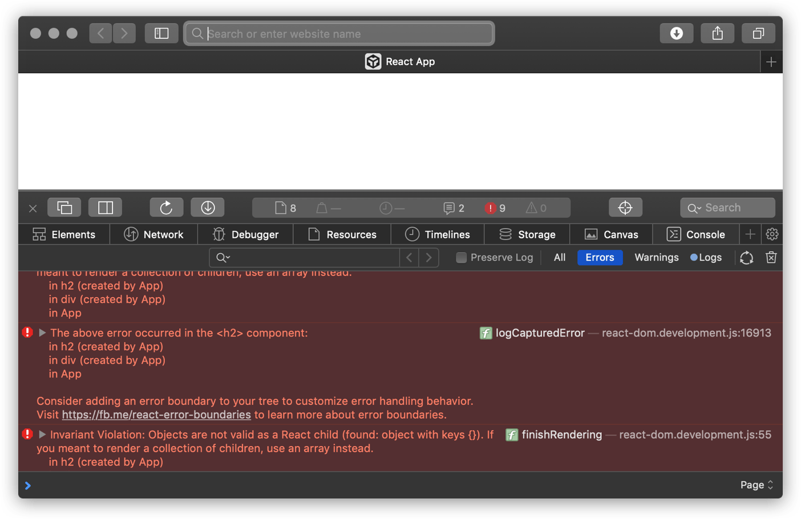
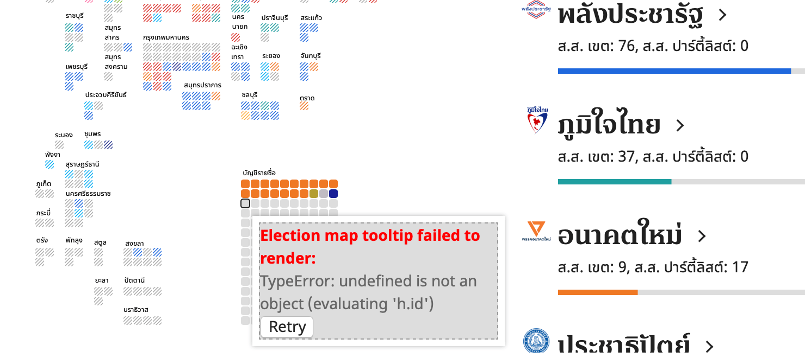

---
authors:
  - dtinth
---

# คอมโพเนนต์เกิดปัญหาอย่าให้มันพังทั้งหน้า ใส่ ErrorBoundary กันไว้ด้วย

<author-list></author-list>

เป็นเรื่องที่มักมองข้ามกันเวลาพัฒนาแอพด้วย React

คือเวลา Component บางตัว ไม่สามารถแสดงผลได้ เนื่องจากข้อผิดพลาดบางอย่าง (เช่น การอ่านข้อมูลจาก undefined)
โดยปกติแล้ว React จะเอาหน้าทั้งหน้าออกไปเลย
เกิดอาการหน้าขาว:

(ขาวทั้งหน้าเลย T_T)

**ในการออกแบบแอพพลิเคชั่นที่ดี
เราควรคำนึงถึงเรื่อง Fault containment ด้วย**
กล่าวคือ เวลาส่วนย่อยของโปรแกรมเกิดปัญหา
เราควรมีมาตรการป้องกัน ไม่ให้ส่วนย่อยๆ ส่วนนั้น สร้างผลกระทบในวงกว้าง
(เช่น ทำให้หน้าเว็บหายไปทั้งหน้า)

**สำหรับโปรเจคที่มีเวลาทำน้อย นี่ยิ่งเป็นเรื่องสำคัญ**
เพราะบางทีเราต้องแก้โค้ดแบบรีบๆ ซึ่งบางที หากเราเผลอเขียนโค้ดบางส่วนผิดเพราะความเร่งรีบ
มันไม่ควรทำให้หน้าเว็บทั้งหน้าหายไป
อย่างน้อยส่วนอื่นๆ ของหน้าเว็บก็ควรจะยังใช้ได้เหมือนเดิม

ซึ่งจริงๆ แล้ว
React สามารถทำได้
โดยการใส่ [Error Boundary](https://reactjs.org/docs/error-boundaries.html) เข้าไป
สามารถ[อ่านวิธีทำได้ใน Documentation ของ React เลย](https://reactjs.org/docs/error-boundaries.html)

ทีนี้ หาก Component ใดมีปัญหา
มันจะไม่ส่งผลให้หน้าทั้งหน้าหายไปละ
ก็จะพังแค่จุดที่มีปัญหาครับ